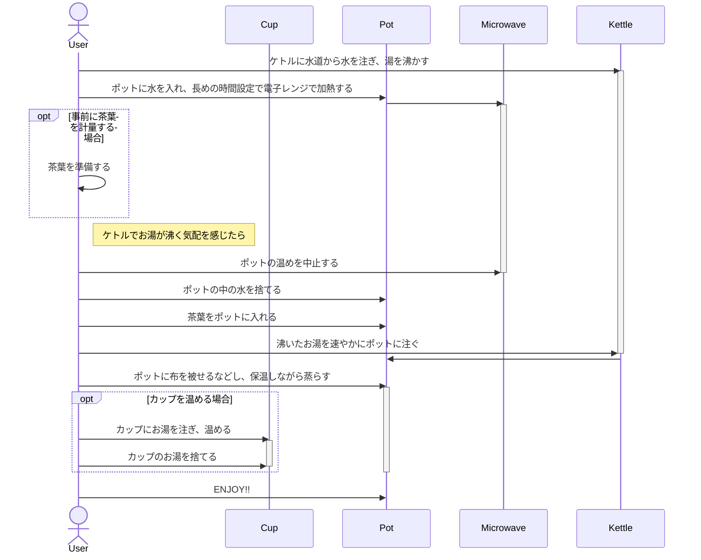

# 紅茶の入れ方

## コツ

### 水は水道から

ポット内で「ジャンピング」を起こすためにはお湯が空気を含んでいる必要があります。

ミネラルウォーター・ウォーターサーバーの水は空気を含んでいないので望ましくありません。
水道からジャバジャバ注いた水がベストです。

### 茶器を温める

抽出中のお湯の温度を下げないことが最も重要なので、抽出に使う茶器（リーフティーならポット、ティーバッグならカップ）を温める必要があります。

飲む用の器は、必要なければ暖める必要はありません。

### すぐ飲む

紅茶は時間が経つと香りが抜け、水色が濁っていきます。

水筒に入れたり冷蔵したりせずに冷めないうちに全部飲むのが望ましいです。

### 茶器は金属以外を使う

カップ、ポットは磁器か陶器が望ましいです。

金属のにおいが移るので金属製のカップを使うことは避けてください。

可能であれば、容器をコーヒーなどにおいの強いものと共用することも避けるとよいです。
